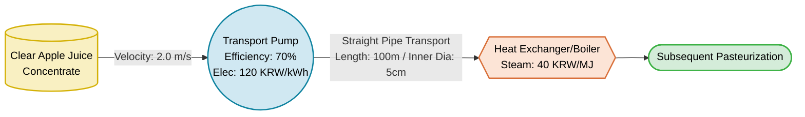
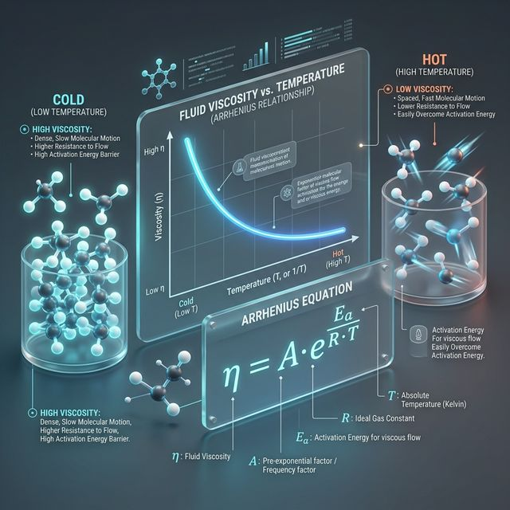

# 💧 Week 5: Rheological Properties Lab (Newtonian Fluids)
**– Pipe Friction Loss Calculation and Python Optimization Simulation for Transport Temperature –**

> 📂 **Navigation**: [← Week 4: Density & Porosity](../week4/Week04_Lab_Density_Porosity.md) · [Main README](../../README.md) · [📝 Quiz Bank](../../QUIZ_BANK.md)

---

## 0. Target Data: Virtual Clear Apple Juice Pipeline

This lab utilizes viscosity variation and energy margin trade-off data of apple juice (Newtonian fluid) traversing a 100m straight pipe.

| Parameter | Data Value |
|-----------|------------|
| Target Product | Clear Apple Juice Concentrate |
| Pipe Specifications | Line length: 100m, Inner diameter: 5cm (0.05m) |
| Target Velocity | 2.0 m/s (Constant) |
| Motor Efficiency | 70% (0.7) |
| Cost Core Constants | Electricity: 120 KRW/kWh, Steam Heat: 40 KRW/MJ |

<br>



---

## 1. Theoretical Background: Rheological Properties and Friction Margin

### 1-1. Shear Stress and Shear Rate
- **Concept**: 
  - `Shear Stress`: The force applied parallel to the surface to induce fluid movement (Unit: Pa).
  - `Shear Rate`: The rate of change of velocity at which one layer of fluid passes over an adjacent layer (Unit: s⁻¹).
- **Newton's Law of Viscosity**: States that shear stress is perfectly proportional to shear rate, with the constant of proportionality designated as the 'Absolute Viscosity'.
- **Application**: Pumping and pipeline transport basis for liquid products without suspended particles like milk, clear juice, and purified water.

<br>


<br>

### 1-2. Temperature-Viscosity Inverse Model (Arrhenius Equation)
- **Concept**: Viscosity drops exponentially as temperature rises due to the acceleration of molecular kinetic energy.
- **Utilization**: Overcoming the dilemma between room-temperature transport (high pump load) and heated transport (high fuel/heating cost).
- **Optimization**: Capturing the absolute minimum point of the combined (pumping + preheating) energy cost curve via Python simulation.

<br>



<br>

### 1-3. Reynolds Number and Friction Loss Estimation
- **Concept**: A dimensionless ratio of inertial forces to viscous forces. Acts as the critical boundary dictating Laminar versus Turbulent flow behaviors.
- **Hagen-Poiseuille Equation**: Mathematical matrix employed to calculate the direct frictional pressure drop (ΔP) induced within laminar pipe flow.

<br>


<br>

---

## 2. Python Algorithm Lab: Viscosity Compute and Energy Cost Optimization

This curriculum translates thermodynamic viscosity constraints into a matrix to render economic cost curves bounding both motor and boiler outputs.

### 📝 [Mandatory] Environment Setup & Execution Guide
1. **Package Installation**: Install required libraries via terminal
   ```bash
   pip install numpy matplotlib scipy
   ```
2. **File Location**: Create and edit `week5/step1_viscosity_optimization.py`
3. **Execution**: Synthesize the script and generate plots via terminal
   ```bash
   python step1_viscosity_optimization.py
   ```

---

### 📊 Python Script Key Highlights (Steps 1 ~ 3)

#### 2-1. [Step 1] Temperature Array Conversion and Arrhenius Viscosity Substitution
- Generate integer step arrays across 10-80 degrees Celsius using `np.arange(10, 81)` and transpose completely to Kelvin absolute temperature values.
- Compute the viscosity dataframe inverse dynamics using the exponential function `np.exp()`.

#### 2-2. [Step 2] Pipe Frictional Pressure Drop and Pumping Power Array Linkage
- Derive the 100m transport pressure drop factor (ΔP) synchronously based on the aforementioned viscosity matrix.
- Quantify the total pump motor power consumption (kW) formulas necessitated to breach the friction barrier.

#### 2-3. [Step 3] Unified Balance UI Visualization Rendering (Mpl Plot)
- **Unit Cost Graph (Triple Line Chart)**: Rendering triple-stacked plots comparing electricity (dashed), steam heat (dotted-line), and total integration cost (solid) overlays.
- **Optimum Point Capture (Vertical Line)**: Algorithmic detection and plotting of the vertical asymptote denoting the absolute minimum cost valley (Optimum Temp).

#### 2-4. 🚀 [Advanced] Variable Schema Permutation Challenge: Viscosity Margin Amplification
- **Objective**: Simulating transport constraints for extremely concentrated, ultra-viscous syrups.
- **Assignment**: Enforce an aggressive 5-fold magnification of the base `mu_0` parameter and simultaneously constrict the `pipe_D` by half (to 0.025m).
- **Observation Point**: Visual identification of a severe rightward shift (toward maximum temperature) of the optimum operating threshold prompted by unmanageable pipe friction resistance.

#### 2-5. 🎛️ [Step 2] Interactive Dynamic Simulator (Slider UI)
- **Script Name**: `step2_interactive_simulation.py`
- **Objective**: Manipulate real-time variables (velocity, inner diameter, base viscosity, etc.) via bottom slider bars and experience the responsive animation where the pressure drop U-curve and optimal temperature (red vertical line) shift dynamically left and right.
- **Observation Point**: Grasping the immediate causal relationship between parameter fluctuations and the resulting economic optimum temperature ($^\circ C$).

#### 2-6. 📐 [Step 3] Pipe Diameter Optimization and Economics Simulator (Trade-off)
- **Script Name**: `step3_pipe_diameter_simulation.py`
- **Objective**: Fusing the Hagen-Poiseuille equation with Discussion 2 (Pipe Diameter vs Economics) to simulate the U-curve optimum margin. Visualizes the trade-off between dropping pumping costs and skyrocketing initial pipe/infrastructure installation fees using a scroll bar mechanic.
- **Observation Point**: Pinpointing the exact inner diameter where total costs converge at the valley bottom, proving why infinitely expanding pipe size to reduce friction is an economic fallacy.

#### 2-7. 🎬 [Step 4] Reynolds Number Dynamic Particle Animation (Laminar vs Turbulent)
- **Script Name**: `step4_reynolds_simulation.py`
- **Objective**: In connection with Discussion 3, intuitively confirm how the Reynolds number fluctuates and transitions from Laminar to Turbulent flow as pipe diameter, velocity, and viscosity are adjusted via interactive sliders.
- **Observation Point**: Witness the exact moment the Reynolds number breaches 4000, causing particles to generate violent vortices and forced vertical mixing (the primary mechanical catalyst for heat exchange efficiency).

---

## 3. 💡 Advanced Discussion Topics

### Topic 1: Analyzing the Trade-off Between Viscosity and Economics
- **Background**: The Week 5 simulation confirms an intersecting tradeoff chart where escalating temperatures steadily curtail motor pumping expenses while triggering an alarming proportional spike in boiler heating fees.
- **Prompt**: Beyond merely tallying operational financial constraints, how must process engineers fuse these energy cost models with biological restrictions like 'Nutritional Integrity Loss' or 'Thermal Degradation' dynamics when forcibly preheating agricultural fluids?

### Topic 2: Optimizing Pipe Diameter Design using the Hagen-Poiseuille Equation
- **Background**: Within the Hagen-Poiseuille mandate determining pipe pressure drop (ΔP), the pipe diameter (D) engages in an inverse square proportionality mapping against pressure attrition.
- **Prompt**: Technically, laying mammoth super-caliber pipes across a factory would drastically eradicate sheer friction losses and save vast pumping costs. Logically speaking, why do real-world system engineers stubbornly cap pipeline expansion and instead resort to installing intermediate booster pumps?

### Topic 3: The Impact of Reynolds Number on Heat Exchange Efficiency
- **Background**: Viscous fluids naturally default to Laminar flow orientations inside heat exchanger (e.g., sterilization) pipelines. Propelling extreme velocities or debilitating viscosity thresholds triggers a shift towards turbulent kinetic chaos.
- **Prompt**: When injecting milk or fruit juice through a High-Temperature Short-Time (HTST) pasteurizer, laminar states offer unequivocally cheaper electrical bills due to fewer friction taxes. Yet developmentally, why does facility architecture intentionally sabotage this energy margin to aggressively enforce 'Turbulent' fluid motion?

---

## 4. 📝 Evaluation Quiz Repository

### Q1. [Theory] Comprehending Newtonian Fluid Viscosity Characteristics
A facility operator turns up the shear rate (pump impeller RPM) to accelerate milk propulsion through a process line. According to Newtonian mechanics, how does the absolute viscosity of the milk react to this artificially surged pipe thrust rate?
- [ ] A. Viscosity rises linearly commensurate with the velocity.
- [ ] B. Viscosity thins out in an inverse proportion to the speed.
- [x] C. Viscosity remains obstinately constant regardless of velocity or shear rate fluctuations.
- [ ] D. Viscosity forms an irregular oscillatory wave function.

### Q2. [Theory] Unit Proportionality of Shear Stress and Shear Rate
In Newton's Law of Viscosity formula ($\tau = \mu \dot{\gamma}$), where the absolute viscosity coefficient ($\mu$) resolves as the linear trajectory slope, what is the globally recognized metric unit representing the Shear Rate ($\dot{\gamma}$)?
- [ ] A. $m/s$
- [x] B. $s^{-1}$ (Reciprocal seconds)
- [ ] C. $Pa$ (Pascals)
- [ ] D. $Stokes$

### Q3. [Python Function] Arrhenius Model Viscosity Exponential Transformation
To universally implement the Arrhenius equation matrix $\mu = \mu_0 \cdot e^{(E_a / RT)}$ rapidly across a Python array dataset, what is the universally deployed Numpy library engine module?
- [x] A. `np.exp()`
- [ ] B. `np.linalg.inv()`
- [ ] C. `np.log10()`
- [ ] D. `np.gradient()`

### Q4. [Theory] Reynolds Number Decoding and Kinematic Flow Comprehension
A mechanical audit of a circular pipe perimeter revealed a calculated Reynolds Number (Re) output of $1,500$. Based on fluid dynamics protocols, how can you define the ruling behavioral mechanism occurring inside the conduit?
- [x] A. The Laminar zone where dominant viscous forces actively suppress erratic inertial motions.
- [ ] B. The chaotic Transition zone denoting a violent clash between laminar and turbulent states.
- [ ] C. The Turbulent zone where supreme inertial vectors generate overwhelming velocity vortices.
- [ ] D. Undetectable zero-gravity state.

### Q5. [Python Function] Extracting the Lowest Cost Data Index Array
Having processed total operational bills from 10 to 80 degrees within the `cost_total_array` variable, which dedicated Numpy operative specifically targets and retrieves only the exact coordinate index corresponding to the lowest recorded (most economical) numeric plateau?
- [ ] A. `np.minimum()`
- [x] B. `np.argmin()`
- [ ] C. `np.sort()`
- [ ] D. `np.where()`

---

## 5. Lab Artifacts Version Control & GitHub Submissions

- The Week 5 module strictly dictates appending assignments back into the legacy repository (`week5` node) for consistent batch management.
- Requirement entails concurrent inclusion of a flawless Python execution script (.py) explicitly alongside the printed `Optimal Temperature Chart Rendering.png`.
- Full remote branch commit and push validation required upon clearance.
